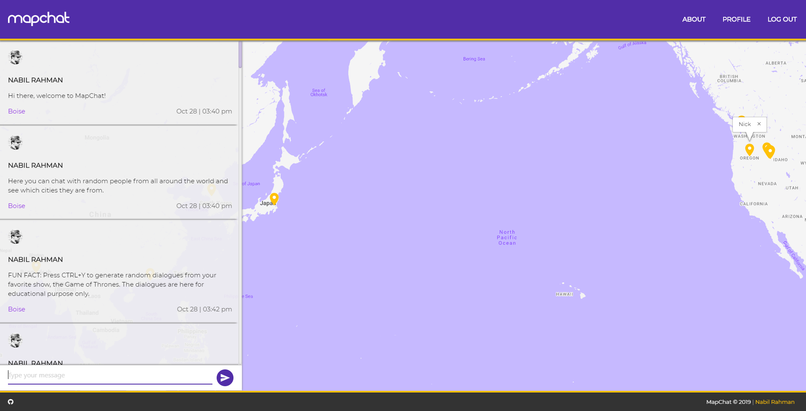
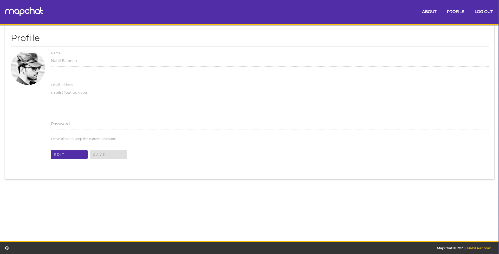
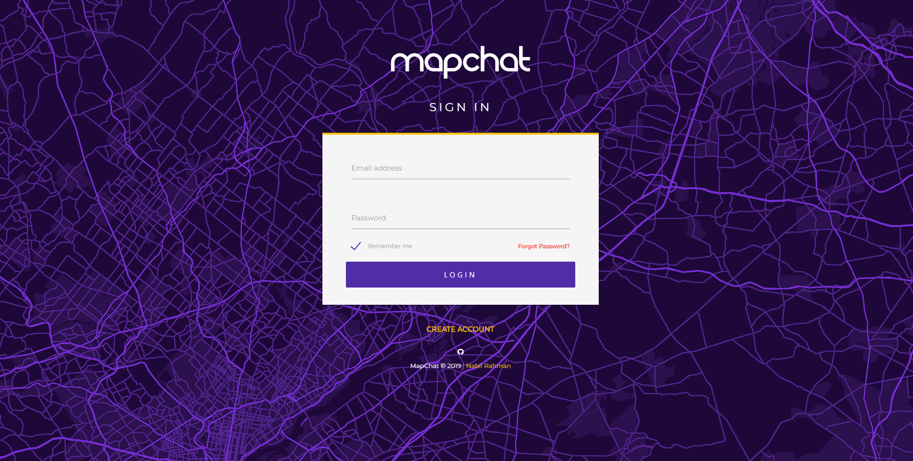
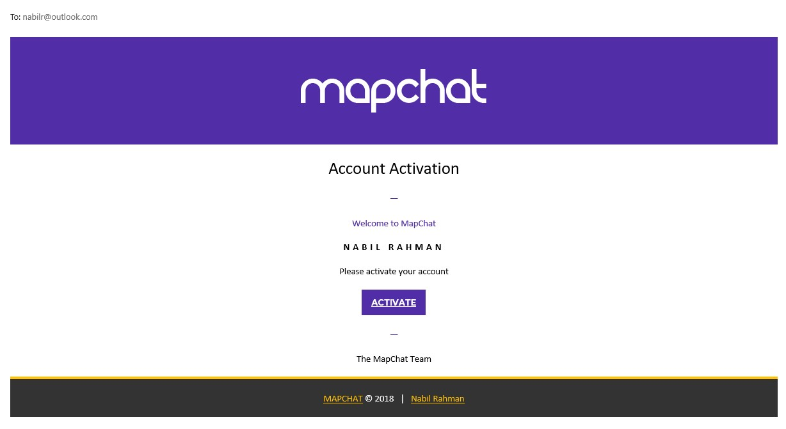
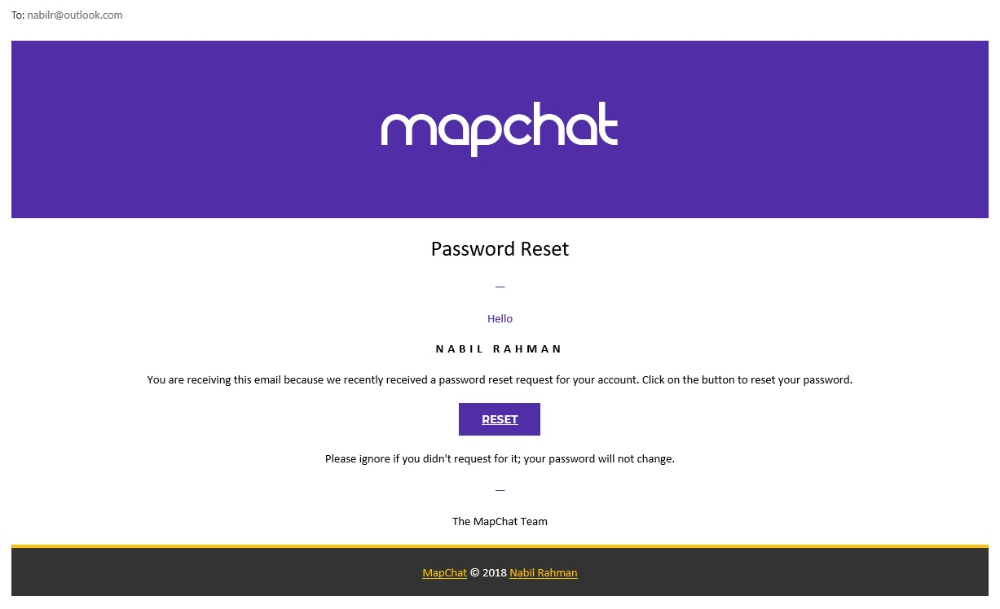

# MapChat

MapChat is a location-based chatting application that lets you talk to people from all around the world. MapChat focuses on real-time interaction with people who don’t know each other. Using MapChat, you can make new friends in your area or have a conversation with someone at the same event as you. You can also tap into the local knowledge of someone from somewhere else before you arrive on holiday in a foreign country perhaps.

The project is fully open-sourced. Visit https://github.com/nabilrhman/MapChat-MVC

## Screenshot

## Software specifications

- A MVC framework developed from scratch.
- The backend is developed in PHP.
- Uses Twig as it's templating engine to generate views.
- Prevents vulnerabilities like cross-site scripting attack, SQL injection by implementing best practices.
- Real-time communication is implemented through AJAX and in some places through Axios.
- Open-sourced, available on  GitHub.

## Tools used

-   PHP
-   JavaScript, jQuery
-   AJAX
-   HTML
-   CSS, materialize.css, animate.css, hover.css
-   Twig (A template engine for the PHP programming language)
-   Composer (An application-level package manager for the PHP programming language)
-   JetBrains PhpStorm IDE

## Developed features

-   Converse real-time with people in a common group.
-   See other people's locations, more specifically which cities they are from.
-   Share your location by your IP address.
-   Easy to use user experience.
-   Create your profile along with your own avatar.- 

## Stretch goals

-   Create your own groups and invite your friends.
-   Ability to share your location not only by your IP address but also through your GPS sensor.
-   Ability to control location sharing.
-   Ability to register anonymously.
-   SHA-256 encryption for all your messages.
-   Utilize the HTTPS protocol for all the communications between the client and the server to ensure security.

## Author

Nabil Rahman | 
https://nabilr.com
